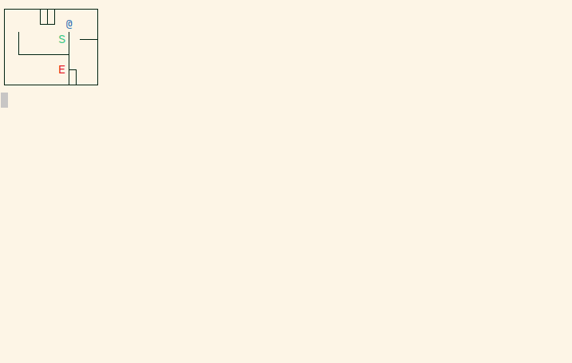
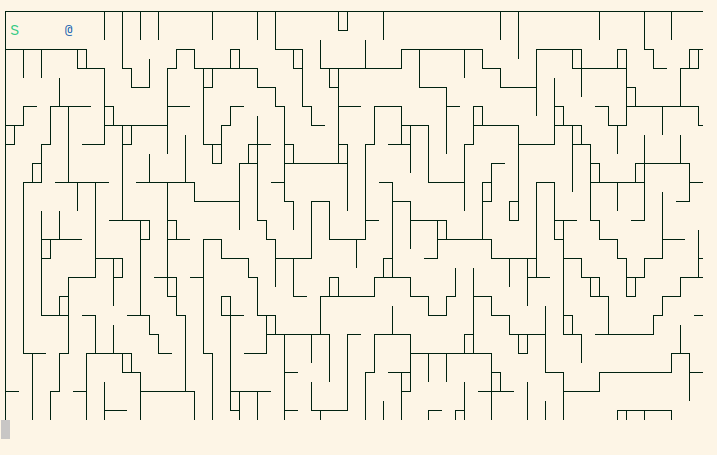

Mazesolver written in C.

Mazesolver reads a maze from a file and tries solving it shows the progress real-time. It uses very simple maze solve walk algorithms. Not really meant as a state-of-the-art maze-solving tool. But the output is nice to look at :).

  

  

# Usage

For usage see

    ./bin/maze -h

Simple usage example:

    ./bin/maze -c -d 5 maps/map5.txt

# Build

To build run

    make

To clean build files run

    make clean

To remove binary run

    make remove

